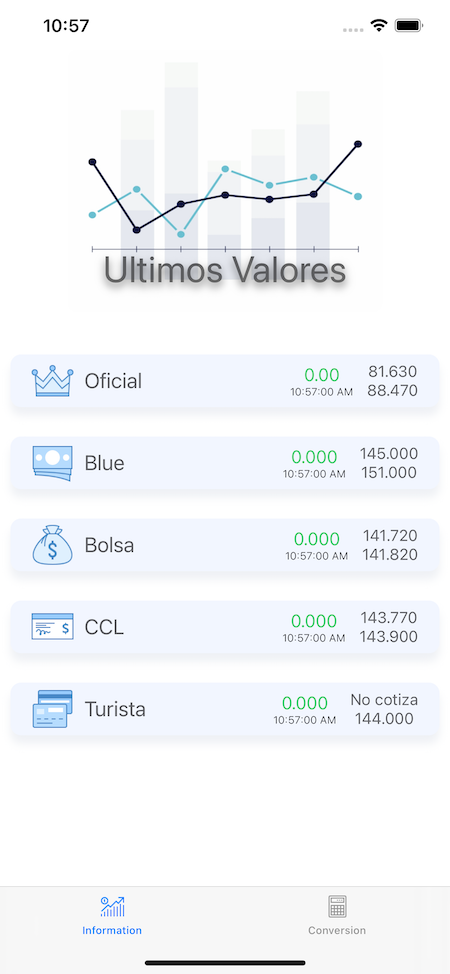
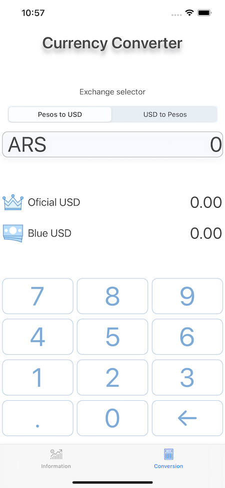

 # Dolar King

### Simple app to know the daily argentinian dolar cotizations and keep track of your purchases

  

    

      
      
    

  

### Packages used: Swift Soup

Simple app to check the constantly changing value of the us dolar expressed in Argentinian pesos.
You can use a conversion table to convert values from usd or argentinian pesos and avoid mental mistakes.

